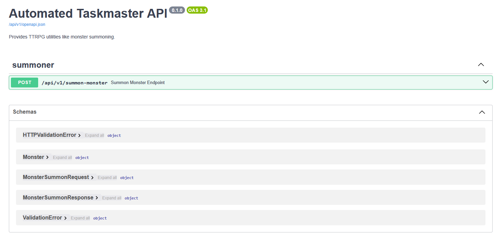

# Automated-Taskmaster

This project involves developing a small, yet practical, TTRPG utility as a Python-based microservice. It demonstrates the use of FastAPI for building APIs, AWS CDK for infrastructure as code, and Docker for containerization. The utility is designed to automate the management of tasks in tabletop role-playing games (TTRPGs). Currently, it just generates random encounters, but it can be extended to include more complex task management features.

## Swagger UI

The Swagger UI for the API is working as expected:

